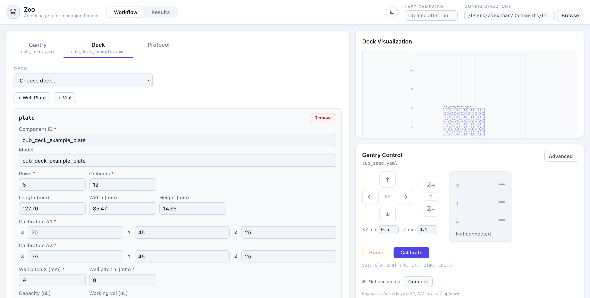

# Zoo

Zoo is the local operator UI for `CubOS`. It provides a FastAPI backend and a
React frontend for editing YAML configs, viewing deck state, controlling gantry
motion, running protocols, and exporting stored results.

Zoo intentionally stays thin: configuration validation, deck math, protocol
execution, motion control, calibration primitives, and data storage come from
CubOS.



## Start here

| Need | Command or path |
| --- | --- |
| Run Zoo locally | `python -m zoo` |
| Backend tests | `pytest tests/` |
| Frontend lint | `cd frontend && npm run lint` |
| Frontend tests | `cd frontend && npm run test` |
| Frontend build | `cd frontend && npm run build` |
| Repo overview | `docs/repo-overview.md` |
| API contracts | `../docs/reference/api-contracts.md` |
| System architecture | `../docs/architecture/system-overview.md` |

## Install and run

```bash
python -m venv .venv
source .venv/bin/activate
pip install -e ".[dev]"

cd frontend
npm ci
cd ..

python -m zoo
```

Defaults:

| Setting | Value |
| --- | --- |
| Host | `127.0.0.1` |
| Port | `8742` |
| Config directory | `configs/` |
| Browser auto-open | Enabled |

If `frontend/dist/` is missing, `python -m zoo` builds the frontend
automatically.

## Project role

Zoo is a UI/API layer over CubOS, not a second implementation of CubOS logic.

- Zoo imports CubOS as an installed package.
- Routers write YAML from UI/API input, then read it back through CubOS loaders
  and schemas.
- Frontend types model API payloads; they should not become a duplicate source
  of CubOS schema truth.
- Hardware-touching routes call CubOS `GantrySession` and runtime APIs.
- The checked-in CubOS dependency currently points at a Git branch in
  `pyproject.toml`; confirm branch strategy before changing it.

Zoo uses CubOS' three-config runtime surface: gantry, deck, and protocol.
Mounted instruments are edited and saved inside gantry YAML.

## Configuration

Zoo reads and writes YAML files from `configs/` by default. The active config
directory is exposed by `/api/settings` as `config_dir`, and operators can
change it through the settings UI or API.

- **Installer seeds:** Fresh Windows installs seed only generic templates:
  gantries `cub_seed.yaml` and `cub_xl_seed.yaml`, plus decks
  `cub_deck_example.yaml` and `cubxl_deck_example.yaml`. Load a gantry seed,
  add the mounted instruments in the Gantry editor, then save the
  machine-specific YAML.
- **Decks:** Use CubOS field names such as `length`, `width`, `height`,
  `x_offset`, `y_offset`, and `diameter`.
- **Gantries:** Load, validate, and save through current CubOS schemas before
  Zoo overwrites YAML. Zoo no longer normalizes older gantry YAML shapes.
- **Protocols:** Saved protocol YAML includes both steps and top-level
  `positions` mappings.
- **Validation:** The protocol Validate button runs full CubOS setup validation
  for the selected gantry, deck, and protocol files.
- **Malformed YAML:** Zoo returns a load error instead of a server traceback.

Hardware controls only enable after the selected gantry file has loaded through
CubOS validation. Protocol runs are blocked while a gantry calibration warning
is active, but connect and calibration remain available so first-time users can
program the controller and clear the warning.

## Gantry control and calibration

The Gantry Control panel supports connection, homing, jogging, absolute
movement, calibration, and advanced recovery. CubOS `GantrySession` owns the
persistent connected gantry, serial operation lock, cached position/status,
manual movement working-volume checks, calibration soft-limit state, and
advanced recovery calls.

Advanced mode exposes recovery and inspection actions through CubOS session
methods:

- Read live GRBL settings.
- Send one numeric GRBL setting.
- Clear alarms.
- Reset and unlock.
- Feed hold.
- Cancel jog.

The calibration wizard follows CubOS' serial calibration flow. Zoo sequences the
operator UI and YAML save path; CubOS handles work-coordinate assignment,
soft-limit programming, temporary soft-limit bypass/restore, and limit
recovery.

Important calibration semantics:

- `working_volume` is the usable deck/WPos range.
- GRBL `max_travel_*` fields are controller soft-limit spans and include the
  configured homing pull-off reserve (`grbl_settings.homing_pull_off`, GRBL
  `$27`).
- Example: homed WPos `Z=91` with `$27=10` saves
  `working_volume.z_max=91` and `grbl_settings.max_travel_z=101`.
- During calibration Zoo sets `$10=0` for WPos status reporting and writes the
  configured `$27` before homing.
- Calibration preserves `cnc.factory_z_travel_mm` as the out-of-box Z travel
  safety bound.
- Disconnect reports a failure if Zoo cannot restore calibration-disabled soft
  limits before closing the controller connection.

If a calibration jog or automatic retract trips a GRBL alarm, Zoo stops repeat
jogs, locks calibration controls, reports the limit hit, and calls CubOS limit
recovery before allowing calibration to continue.

## Protocol editing and execution

The protocol editor builds fields from CubOS command schemas. It uses the
loaded deck, gantry config, and protocol `positions` mapping to offer choices
for plates, instruments, deck targets, named protocol positions, and measurement
methods.

- Top-level `positions`, such as `park_position`, are edited in the Named
  Positions panel.
- ASMI indentation steps expose method options including `force_limit`,
  `step_size`, `baseline_samples`, and `measure_with_return`.
- Protocol execution is enabled only when the gantry position poll reports an
  active connection.
- While a protocol is running, Zoo keeps the running state visible and exposes
  a Cancel Run control that requests CubOS gantry feed hold.
- Each run goes through `GantrySession.run_protocol()`, which creates one CubOS
  `DataStore` campaign for the selected gantry, deck, and protocol files,
  registers nested deck labware, executes against the already-connected gantry,
  and returns `campaign_id`.

The older `/api/protocol/validate` endpoint remains a command-schema check
only; use the UI Validate action for full setup validation.

### Sending YAML bundles from another machine

`POST /api/protocol/run-bundle` accepts the PiCub_protocol_sender station
contract: `run_id` plus inline `gantry_config`, `deck_config`, and
`protocol_yaml` text (optional `mock_mode`, `metadata`). The bundle is staged
under a per-run directory (`bundle_runs/<run_id>/` next to the active config
dir, override with `ZOO_BUNDLE_RUN_DIR`) — never the shared config library —
executed, and the result JSON is stored alongside the inputs. Real runs go
through the persistent gantry session exactly like `/run` and share its
one-run-at-a-time gate (409 when busy); `mock_mode` executes on CubOS offline
drivers with no hardware. `GET /api/protocol/bundle-runs/{run_id}` returns the
stored inputs/result/error for audit and replay.

## Results

The Results view reads stored output through CubOS data export helpers from the
default `DataStore` path.

Set `ZOO_DATA_DB_PATH` to override the Results view path without changing the
CubOS runtime store. Set `CUBOS_DATA_DB_PATH` to move the shared default store.

| API | Purpose |
| --- | --- |
| `/api/data/campaigns` | List campaign rows. |
| `/api/data/campaigns/{campaign_id}/measurements.zip` | Export raw CSV files for populated CubOS instrument measurement tables. |
| `/api/data/campaigns/{campaign_id}/asmi.zip` | Export the legacy ASMI-specific archive. |

Campaign rows include run time, experiment count, well count, measurement
count, and description.

The ASMI-specific archive contains raw per-well CSV files and a `metadata.csv`
file with per-well run settings.

## Windows Operator Installer

The Windows installer builder lives in `installer/windows/`. It clones Zoo
`main` and CubOS `main`, builds the frontend, prepares an offline wheelhouse,
and emits an Inno Setup installer that installs an app-local Python runtime and
venv. The installer carries the Python installer inside the app directory, and
the launcher verifies or repairs the private runtime before starting Zoo.
Optional public driver packages are selected in the installer wizard; ASMI
support is selected by default and installs `godirect`, while proprietary
driver packages are not bundled.

Build it on a Windows packaging machine with Git, Python 3.11, Node.js, and
Inno Setup 6:

```powershell
powershell -ExecutionPolicy Bypass -File .\installer\windows\build-installer.ps1
```

## Repository Map

| Path | Purpose |
| --- | --- |
| `zoo/app.py` | FastAPI app factory |
| `zoo/__main__.py` | Startup entrypoint |
| `zoo/config.py` | `ZOO_*` settings and config directory handling |
| `zoo/routers/` | REST endpoints |
| `zoo/services/` | YAML file helpers |
| `frontend/src/` | React + TypeScript application |
| `frontend/dist/` | Built frontend served by FastAPI |
| `configs/` | Default local config store and generic installer config seeds |
| `tests/` | Backend tests |

## Operational Notes

- Gantry operations, including calibration, are hardware-touching and should be
  treated as high risk.
- Raw YAML endpoints bypass schema-aware editing and can write malformed files
  if used carelessly.
- `frontend/README.md` is the stock Vite template and is not authoritative
  project documentation.
